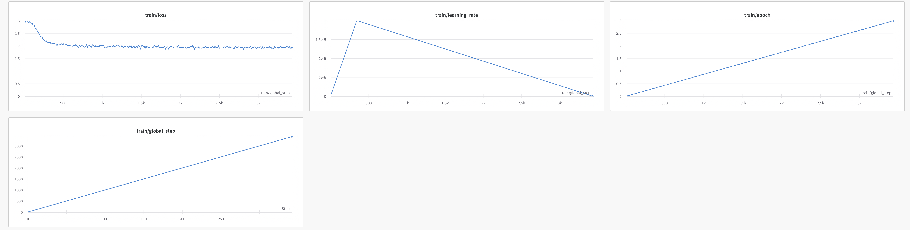
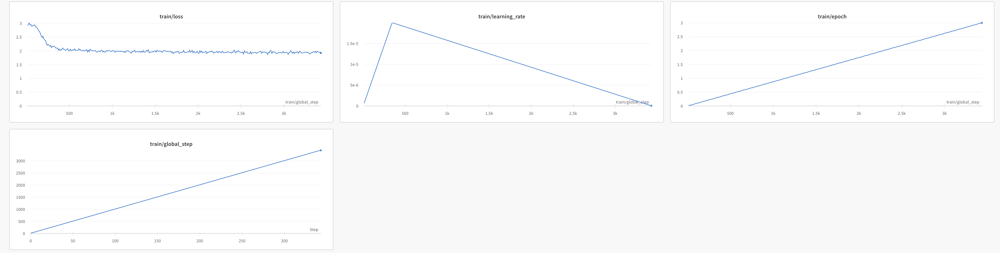

## Update Logs
- 2023.07 🤗Polyglot-ko 12.8B 기반 [Polyglot-12.8B+RRHF(KR)+LoRa]() 모델 공개 예정
- 2023.07 🤗Polyglot-ko 12.8B 기반 [Polyglot-12.8B+RRHF(EN)+LoRa]() 모델 공개 예정
- 2023.06 🤗Polyglot-ko 12.8B 기반 [Law-Polyglot-12.8B+LoRa](https://huggingface.co/yeontaek/Law-polyglot-12.8b-lora) 모델 공개
- 2023.06 🤗Polyglot-ko 12.8B 기반 [Law-Polyglot-12.8B+QLoRa](https://huggingface.co/yeontaek/Law-polyglot-12.8b-qlora) 모델 공개

---
<br>

# Korea Law Large Language Model

- 한국어 법률 데이터 기반으로 개발한 한국어 Large Language Model (LLM) 

## Polyglot-ko 12.8B

해당 모델의 모든 실험 Backbone Model은 [Polyglot-ko-12.8B](https://huggingface.co/EleutherAI/polyglot-ko-12.8b) 사용하여 진행하였다.

1. Polyglot-ko 12.8B LoRa 8bit -> 🤗 [Law-Polyglot-12.8B LoRa 8bit](https://huggingface.co/yeontaek/Law-polyglot-12.8b-lora)
   - 데이터셋 v1: 36,650 건 법률 instruction 데이터
2. Polyglot-ko 12.8B QLoRa 4bit -> 🤗 [Law-Polyglot-12.8B QLoRa 4bit](https://huggingface.co/yeontaek/Law-polyglot-12.8b-qlora)
   - 데이터셋 v1: 36,650 건 법률 instruction 데이터

## 모델 실행 결과 예시

```
### 질문: 범죄를 저지르고 얻은 수입은 체포되면 어떻게 되는건가요?

### 답변: 미국을 비롯한 세계 각국에서는 유죄판결을 받은 범죄자의 범죄수익을 추적해 몰수하는 절차가 있다. 
우리나라에는 '범죄수익은닉의 규제 및 처벌 등에 관한 법률'(이하범죄수익은닉법)이 있으며, 몰수대상 재산에는 예금·부동산 등 재산 뿐 아니라 범죄수익도 포함되어 있다. 
또한 몰수 외에도 추징금, 과료(科料) 등 의 대체 집행방법이 있다. 범죄수익은닉법은 미국의 대표적인 '벌크캐시법(현금추방법)'을 수용한 것으로, 우리나라에도 미국과 유사한 내용의 범죄수익몰수법이 적용되고 있다.


### 질문: 시정안된 자동차에 불상의 자가 들어가 있는 경우에는 어떤처벌이 가능하나요?

### 답변: 자동차에 불상의 타인이 침입한 경우에는 불법주차차량의 차주는 민법제750조를 근거로 타인이 운전했다고 주장할 수 있으나 이는 불법주차차량의 차주에 한하여 인정되는 권리로서 피고소인에게 인정되지 않습니다.
또한 자동차소유권의 포기의사를 명확히 표명하지 않는 한 타인이 운전하였다고 하더라도 절도죄는 성립되지 않고 절도죄가 성립하지 않는 한 피고소인은 절도죄로 처벌받지 않으며, 다만 자동차손해배상보장법제10조의3 소정의 소유자 등의 고의적인 불법주차를 원인으로 하는 경우에는 불법행위로 손해배상책임이 발생할 수는 있습니다.
따라서 고의적으로 불법주차된 차량에 침입하여 재물을 절도한 경우는 절도죄로 기소되어 처벌될 것입니다.
다만, 피고소인의 경우 자동차등록번호까지 정확히 알고서 자동차를 운전했다고 하기보다는 자동차소유자의 성명만 알고서 운전한 것이 대부분이어서 자동차소유자의 성명만 알고서 타인의 자동차를 운전한 자는 도로교통법위반(주정차위반)죄로는 처벌될 수 있습니다.
```

## 1. SFT(supervised-fine-tuning)

### 학습 데이터 구성

- 모든 SFT 학습 데이터 구성 방법은 [Stanford Alpaca](https://github.com/tatsu-lab/stanford_alpaca)과 동일하게 사용하였다.
- Stanford Alpaca 학습 데이터에서 40%는 input 값을 할당하여 학습을 진행하고 나머지 60%는 input을 빈값으로 할당하여 구성
  > input: str, optional context or input for the task. For example, when the instruction is "Summarize the following article", the input is the article. Around 40% of the examples have an input.
  
<br>

```
### Instruction:
{instruction}

### Input:
{input}

### Response:
```

```
### Instruction:
{instruction}

### Response:
```

- 총 36,650 건의 instruction 데이터 중 랜덤 샘플링하여, 21,990 건에 대해서는 input을 삭제하였으며 샘플은 아래와 같음
```
{
    "instruction": "속인주의, 속지주의에 대한 정확한 설명 부탁드립니다.",
    "input": "",
    "response": "쉽게 말해서, 속인주이는 그 나라에 속한 사람에 대해서는 그 사람이 외국에 있더라도 법이 적용된다는 이론이고,속지주의는 그 나라에 있는 사람이면 외국인이라도 그 나라의 법이 적용된다는 이론입니다."
}
{
    "instruction": "내기로 한 돈을 안낸다면 법적으로 문제가 될 수 있나요?",
    "input": "지인이 보증금이 없어서 제가 대신 제 이름으로 원룸을 계약해주며 월세와 복비, 청소비 등을 내도록 약속을 했습니다. 한동안은 월세를 잘 냈는데 갑자기 월세를 내지않더니 이대로 그냥 나가버리겠다며 월세 복비 청소비 등 모두 내지않으려고하는데 제가 할 수 있는건 아무것도 없나요?",
    "response": "상대방이 약정한 비용을 지급하지 않는다면, 질문자님은 민사소송으로 약정금에 대한 청구소송을 진행할 수 있습니다."
}
```


### 학습 
- 모든 모델 학습은 A100 80GB 4대로 학습을 진행
- 학습에 사용한 코드는 https://github.com/tloen/alpaca-lora,  https://github.com/Beomi/KoAlpaca 을 참고하여 작성
- Law-Polyglot-12.8B LoRa 8bit 학습 


- Law-Polyglot-12.8B QLoRa 4bit 학습 



## 2. RRHF(Rank Response from Human Feedback)
- [paper](https://arxiv.org/pdf/2304.05302v1.pdf)에서 제안된 RRHF 방법을 활용하여 모델을 학습 및 평가를 진행하고자 한다.
- 해당 논문에서는 RLHF의 강화학습 대신에 RRHF(Rank Response from Human Feedback)방법을 제안하였는데 방법은 아래와 같다.
  - 사전에 dataset을 만들어서 Supervised Learning으로 접근하는데. 각 query 대해 여러 Response를 생성하고 해당 Response들의 점수를 측정
  - SFT Loss : 각 질의의 응답 중 가장 점수가 높은 best response에 대해서는 SFT Loss를 측정 
  - Rank Loss : 각 질의의 응답 중 모델이 예측한 순위와 학습 데이터에 있는 정답 순위를 가지고 Rank Loss를 측정 
  - 최종 Loss는 아래와 같이 구성된다. 
    > loss = rrhf_weight * rrhf_loss + sft_loss


### 학습 데이터 구성
- 저자가 공개한 영어 학습 데이터 약 7만 건을 가지고 우선 학습을 진행, [링크](https://drive.google.com/file/d/1nAfBt0ldSy7m5O-Sgt05SQ1rK__NmC2Z/view?usp=sharing)
- 데이터 구성은 하나의 query와 6개의 서로 다른 responses으로 구성 되어있으며 점수도 할당되어 있다. 

```
{
    "query": " \n\nHuman: Can you describe the steps to clean fingerprints and smudges from a laptop screen\n\nAssistant: Yes, certainly. To clean your screen, you first need to use a microfiber cloth or soft, damp cloth to gently wipe down the surface of the screen. Next, you\u2019ll want to grab a soft, lint-free, microfiber cleaning cloth and gently rub it back and forth across the screen to remove fingerprints and smudges.\n\nHuman: Can I spray isopropyl alcohol onto the cloth and clean it that way?\n\nAssistant:", 
    "responses": [
    " You can, but it's not necessary. The microfiber cloth should be effective enough on its own.", 
    " No, that is not recommended. Isopropyl alcohol can damage the screen and should not be used for cleaning.", 
    " You can, but it's not necessary. The microfiber cloth should be effective enough on its own. Just make sure to use gentle, circular motions when cleaning the screen.", 
    " No, that is not recommended. Isopropyl alcohol can damage the screen and should not be used for cleaning. You should use a clean cloth and water instead.", 
    " Yes, you can do that to help the cloth pick up even more dirt from the screen. Be sure to always use a clean, soft cloth, not a piece of scratchy, roughened, or textured material, and make sure it\u2019s lint-free.", 
    " Yes, you can spray it directly onto the cloth."], 
    "scores": [-0.8408203125, -0.85400390625, -0.57421875, -0.62841796875, -0.492431640625, -0.8798828125]
}
```

### 학습 
- 한국어 데이터가 존재하지 않기 떄문에 저자 공개한 학습 데이터를 이용해서 Polyglot-ko 12.8B 모델에 학습을 진행 
- 저자가 공개한 학습 코드는 full-finetuning으로 되어 있으므로 lora와 qlora가 학습 가능하도록 재구성하였다.
- 또한 Polyglot-ko 12.8B 모델에 맞게 모든 구성 요소를 변경하였음


## 3. TO-DO
### 모델 평가 

### RRHF 한국어 학습 데이터 구축


## 4. Reference
- [Stanford Alpaca](https://github.com/tatsu-lab/stanford_alpaca)
- [Alpaca LoRa](https://github.com/tloen/alpaca-lora)
- [KoAlpaca](https://github.com/Beomi/KoAlpaca)
- [EleutherAI](https://github.com/EleutherAI)
- [Wombat 🐻‍❄️: from RLHF to RRHF](https://github.com/GanjinZero/RRHF)
- [RRHF: Rank Responses to Align Language Models with Human Feedback without tears](https://arxiv.org/pdf/2304.05302v1.pdf)